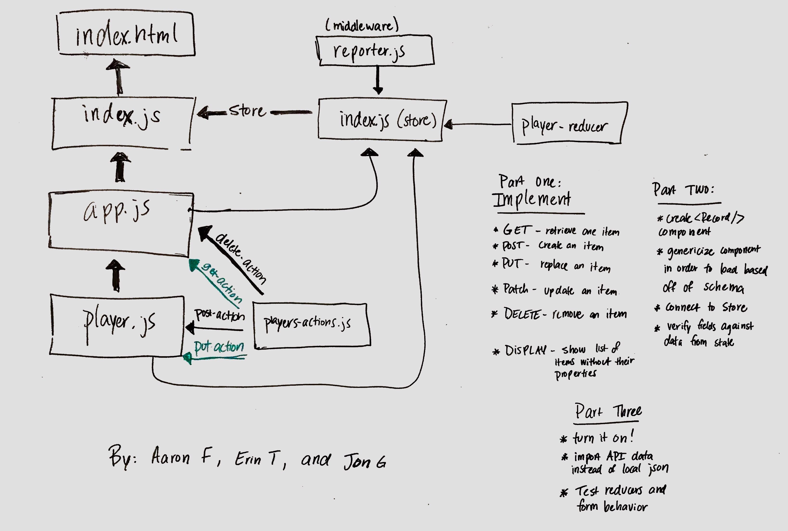

 Lab 32: Dynamic Forms
============================================================================  
Date: April 29th, 2019  
Author: Aaron Ferris
  
UMLs Completed with: Erin Trainor, Jon Gentry, Cory Henderson  
  
[LAB INSTRUCTIONS](./LAB.md)  
No Pull Request
[Current Stater](https://github.com/codefellows-js-401d29-aaron-ferris/lab32)
  
## Part 1: Implement 

### Tasks
[x] GET  
[x] POST  
[x] PUT  
[x] PATCH (I implemented this like put. I don't think I did it right)  
[x] DELETE  
[x] Display all children  
  
  
### Sandbox Submission
  
[part one sandbox](https://codesandbox.io/s/github/abferris/lab32/tree/master/)  

### Notes:
* Part 2 and 3 of the lab were not completed. We spent a long time and didn't get as far as we wanted. We had a rough time
